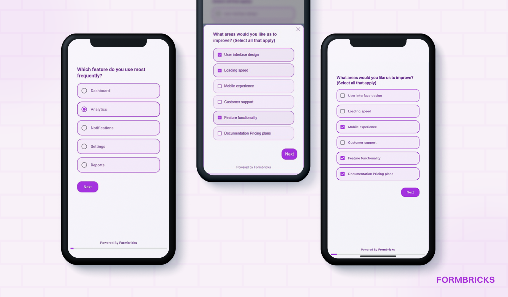

# Formbricks Flutter SDK
[](https://pub.dartlang.org/packages/formbricks_flutter)
[](https://pub.dev/packages/formbricks_flutter/score)
[](https://pub.dev/packages/formbricks_flutter/score)


**Formbricks Flutter** lets you easily integrate beautiful, customizable, in-product formbricks **micro-surveys** directly into your Flutter apps. Collect user feedback where it matters most — inside your product.

Built on top of [Formbricks](https://formbricks.com) — the open-source experience, privacy-first management platform — this SDK offers all the flexibility you need to launch surveys, and adapt the UI to match your brand.

---



## ✨ Features

| Feature                         | Description                                                                                                              |
|---------------------------------|--------------------------------------------------------------------------------------------------------------------------|
| 💬 **In-App Micro-Surveys**     | Display beautiful, embeddable surveys inside your app using flutter implementation.                                      |
| 💬 **Webview Micro-Surveys**    | Display beautiful, embeddable surveys inside your app using formbricks browser.                                          |
| 🌐 **Localization Support**     | Built-in support for multiple languages: `en`, `es`, `de`, `fr`, `ja`, `ar`, `pt`, `sw`, `zh`.                           |
| ⚡ **Custom Triggers**           | Trigger surveys based on app events.                                                                                     |
| 🎨 **Theme Customization**      | Use Formbricks styling or fallback to Style surveys using your app’s `ThemeData`. or use a different custom theme for it |
| 🙋‍♂️ **User Targeting**        | Pass `userId` and `userAttributes` to personalize surveys.                                                               |
| 🪟 **Multiple Display Modes**   | Show In-App surveys in `fullScreen`, `dialog`, or `bottomSheet` views.                                                   |
| 🧱 **Custom Question Widgets**  | Override default widgets with your own beautiful UI.                                                                     |
| ⏱ **Estimated Completion Time** | Automatically calculated time to inform users.                                                                           |
| 🔐 **Secure API Integration**   | Connect with the Formbricks API using your API key and environment ID.                                                   |
| 🧪 **Dev Mode Toggle**          | Enable/disable development mode for previewing surveys.                                                                  |
| 🧪 **v2 Mode Toggle**           | Decide which version of the APIs you want to use                                                                         |

---

## 🚀 Installation

Add `formbricks_flutter` to your `pubspec.yaml`:

```yaml
dependencies:
  flutter:
    sdk: flutter
  formbricks_flutter: ^0.0.4 #Replace with the latest version
```

---

## 🛠 Usage

Wrap your app (or section of it) with the `FormbricksProvider`:

```dart
FormbricksProvider(
  client: FormbricksClient(
    appUrl: 'https://app.formbricks.com',
    environmentId: 'your-env-id',
    apiKey: 'your-api-key',
    isDev: false,
    useV2: false
  ),
  userId: 'user-123',
  surveyPlatform: SurveyPlatform.inApp,
  surveyDisplayMode: SurveyDisplayMode.fullScreen,
  child: const HomeScreen(),
);
```

```dart
    MaterialApp(
      title: 'Flutter Demo',
      localizationsDelegates: AppLocalizations.localizationsDelegates, /// make sure to include this
      supportedLocales: AppLocalizations.supportedLocales, /// make sure to include this
      locale: Locale('en'), // or make dynamic
      home: FormbricksProvider(
        client: FormbricksClient(
            appUrl: 'https://app.formbricks.com',
            environmentId: 'your-env-id',
            apiKey: 'your-api-key',
            isDev: false,
            useV2: false
        ),
        userId: 'user-123',
        surveyPlatform: SurveyPlatform.inApp,
        surveyDisplayMode: SurveyDisplayMode.bottomSheetModal,
        checkForNewSurveysOnRestart: true,
        child: const HomeScreen(),
      ),
    )
```
---

## 📦 Customization Options

You can define custom theme or override any survey question widget using FormbricksFlutterConfig.
Note: custom theme works only if _overwriteThemeStyling_ property of the survey is set to false

```dart
FormbricksProvider(
    // required declarations
    ...
    formbricksInAppConfig: FormbricksInAppConfig(
        customTheme: ThemeData(
            textTheme: TextTheme(
                headlineMedium: const TextStyle(fontSize: 16, fontWeight: FontWeight.bold),
            )
        ),
        freeTextQuestionBuilder: (key, question, onResponse, response, requiredByLogicCondition, {formbricksClient, surveyId}){
          return CustomFreeTextWidget(question: question, onResponse: onResponse, response: response, requiredByLogicCondition: requiredByLogicCondition);
        },
        // Other overrides: addressQuestionBuilder, dateQuestionBuilder, etc.
        ...
    ),
)
```


Sets the current user’s unique identifier (e.g., user ID or email).
```dart
  Formbricks.instance.setUserId("abc@xyz.com");
```

Sets or replaces the user’s attributes for segment filtering and targeting
```dart
  Formbricks.instance.setAttributes({"first_name": "Green", "last_name": "Onyeji"});
```

Adds or updates specific user attributes without replacing existing ones.
```dart
  Formbricks.instance.setAttribute({"location": "Abuja"});
```

Trigger any survey associated with that action
```dart
  Formbricks.instance.track(action: "download_button", buildContext: context);
```

Sets the language code for surveys (e.g., "en", "de", "fr").
```dart
  Formbricks.instance.setLanguage("de");
```

Sets the survey platform (e.g., inApp, webView)
```dart
  Formbricks.instance.setSurveyPlatform(SurveyPlatform.inApp);
```

Sets how surveys should be displayed for inApp (e.g. fullscreen, dialog, bottomSheetModal)
```dart
  Formbricks.instance.setSurveyDisplayMode(SurveyDisplayMode.fullScreen);
```

---

## 🧪 Supported Question Types

Formbricks currently supports the following input types:
- 📍 `address`
- 📅 `cal`
- ✅ `consent`
- 👤 `contact`
- 🪄 `cta`
- 📅 `date`
- 📁 `file upload`
- 📝 `freeText`
- 📊 `matrix`
- 🧩 `multipleChoiceMulti`
- 🔘 `multipleChoiceSingle`
- 📈 `nps`
- 🖼️ `pictureSelection`
- 🔢 `ranking`
- ⭐️ `rating`

And **you can override any of them** for full control.

---
### Full example

```dart
import 'package:flutter/material.dart';
import 'package:formbricks_flutter/formbricks_flutter.dart';

void main() {
  runApp(const MyApp());
}

class MyApp extends StatelessWidget {
  const MyApp({super.key});

  // This widget is the root of your application.
  @override
  Widget build(BuildContext context) {
    return MaterialApp(
      title: 'Flutter Demo',
      localizationsDelegates: AppLocalizations.localizationsDelegates,
      supportedLocales: AppLocalizations.supportedLocales,
      locale: Locale('en'), // or make dynamic
      home: FormbricksProvider(
        client: FormbricksClient(
            appUrl: 'https://app.formbricks.com',
            environmentId: 'your-env-id',
            apiKey: 'your-api-key',
            isDev: false,
            useV2: false
        ),
        userId: 'gideonvideon',
        surveyPlatform: SurveyPlatform.inApp,
        surveyDisplayMode: SurveyDisplayMode.bottomSheetModal,
        checkForNewSurveysOnRestart: true,
        child: const HomeScreen(),
      ),
    );
  }
}

class HomeScreen extends StatelessWidget {
  const HomeScreen({super.key});

  @override
  Widget build(BuildContext context) {
    return Scaffold(
      appBar: AppBar(title: const Text('My App')),
      body: Center(
        child: Column(
          mainAxisAlignment: MainAxisAlignment.center,
          children: [
            ElevatedButton(
              onPressed: () {
                Formbricks.instance.setSurveyPlatform(SurveyPlatform.inApp);
                Formbricks.instance.setSurveyDisplayMode(SurveyDisplayMode.fullScreen);
                Formbricks.instance.track(action: "click_button");
              },
              child: const Text('Launch Survey inApp in fullscreen'),
            ),
            SizedBox(height: 10,),
            ElevatedButton(
              onPressed: () {
                Formbricks.instance.setSurveyPlatform(SurveyPlatform.inApp);
                Formbricks.instance.setSurveyDisplayMode(SurveyDisplayMode.bottomSheetModal);
                Formbricks.instance.track(action: "click_button");
              },
              child: const Text('Launch Survey inApp in bottom sheet modal'),
            ),
            SizedBox(height: 10,),
            ElevatedButton(
              onPressed: () {
                Formbricks.instance.setSurveyPlatform(SurveyPlatform.inApp);
                Formbricks.instance.setSurveyDisplayMode(SurveyDisplayMode.dialog);
                Formbricks.instance.track(action: "click_button");
              },
              child: const Text('Launch Survey inApp in alert dialog'),
            ),
            SizedBox(height: 10,),
            ElevatedButton(
              onPressed: () {
                Formbricks.instance.setSurveyPlatform(SurveyPlatform.webView);
                Formbricks.instance.track(action: "click_button");
              },
              child: const Text('Launch Survey as Web Browser'),
            ),
          ],
        ),
      ),
    );
  }
}

```

## 📜 License

This SDK is released under the MIT License.

